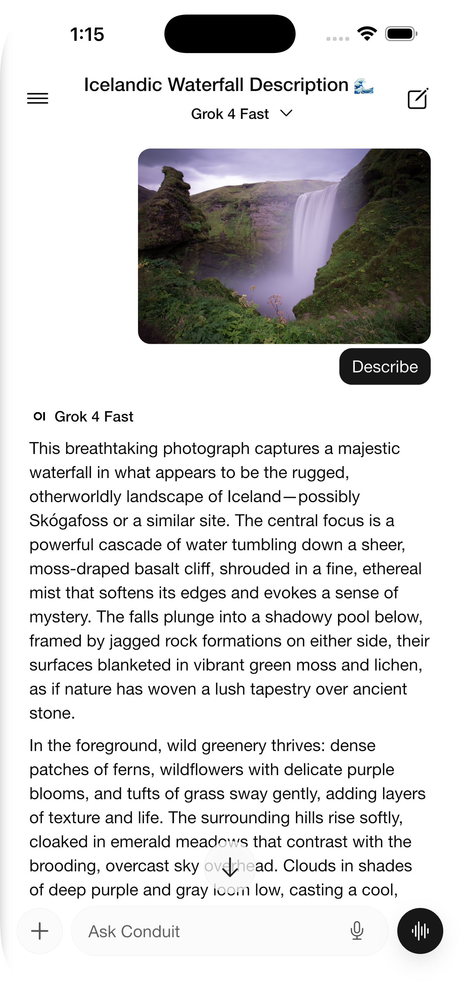
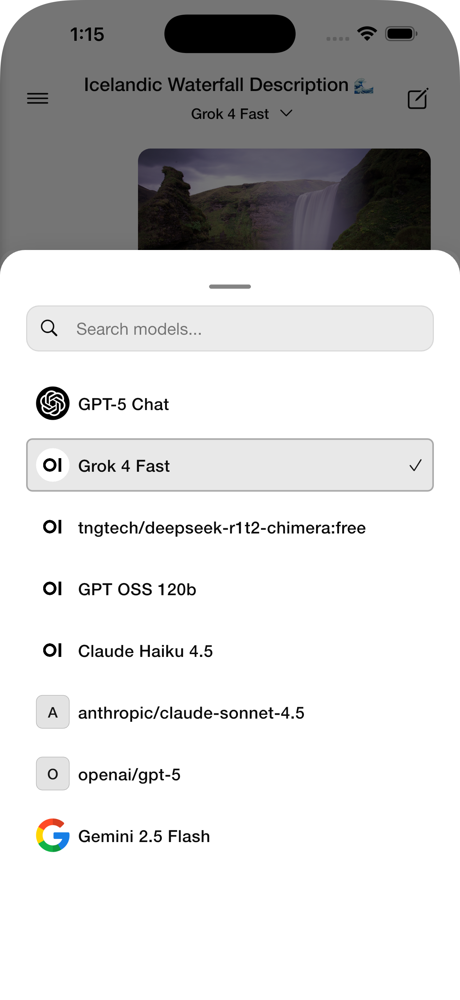
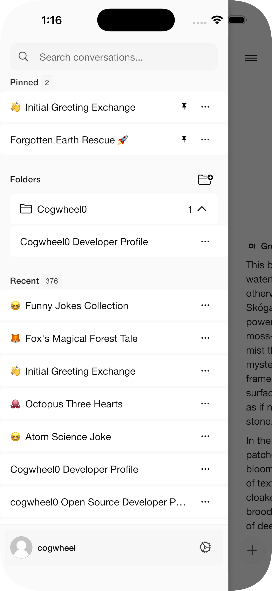
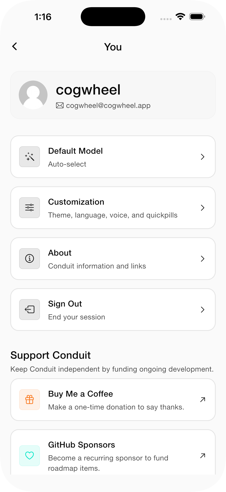

# Conduit

<div align="center">


<a href="https://play.google.com/store/apps/details?id=app.cogwheel.conduit">

</a>
<a href="https://apps.apple.com/us/app/conduit-open-webui-client/id6749840287">

</a>

</div>

<br>

<div align="center">

</div>

<br>

Conduit is an open-source, cross-platform mobile application for Open-WebUI, providing a native mobile experience for interacting with your self-hosted AI infrastructure.

## Table of Contents

- [Features](#features)
- [Screenshots](#screenshots)
- [Requirements](#requirements)
- [Quickstart](#quickstart)
- [Installation](#installation)
- [Building for Release](#building-for-release)
- [Configuration](#configuration)
- [Localization (i18n)](#localization-i18n)
- [Compatibility](#compatibility)
- [Docs](#docs)
- [Architecture](#architecture)
- [Troubleshooting](#troubleshooting)
- [Security & Privacy](#security--privacy)
- [Contributing](#contributing)
- [License](#license)
- [Support](#support)

## Quickstart

```bash
git clone https://github.com/cogwheel0/conduit && cd conduit
flutter pub get
dart run build_runner build --delete-conflicting-outputs
flutter run -d ios   # or: -d android
```

## Features

### Core Features
- **Real-time Chat**: Stream responses from AI models in real-time
- **Model Selection**: Choose from available models on your server
- **Conversation Management**: Create, search, and manage chat histories
- **Markdown Rendering**: Full markdown support with syntax highlighting
- **Theme Support**: Light, Dark, and System themes

### Advanced Features
- **Voice Input**: Use speech-to-text for hands-free interaction
- **File Uploads**: Support for images and documents (RAG)
- **Multi-modal Support**: Work with vision models
- **Secure Storage**: Credentials stored securely using platform keychains
- **Folder Management**: Organize conversations into folders; create, rename, move, and delete
 - **Tools (Function Calling)**: Invoke server-side tools exposed by Open‑WebUI, with result rendering

### Authentication
Conduit supports multiple authentication flows when connecting to your Open‑WebUI:
- **Username + Password**: Sign in directly against servers that expose a login endpoint. Credentials are stored securely using platform keychains.
- **SSO / OAuth** (iOS & Android): Authenticate via your server's configured OAuth providers (Google, Microsoft, GitHub, OIDC, etc.) using an in-app WebView. The token is automatically captured after the OAuth flow completes.
- **Reverse Proxy Support** (iOS & Android): Seamlessly connect to Open WebUI instances behind authentication proxies like oauth2-proxy, Authelia, Authentik, Pangolin, Cloudflare Tunnel, etc. Conduit automatically detects when proxy authentication is required and guides you through the login flow—no endpoint allowlisting or server-side configuration needed. Proxy session cookies are captured from the native cookie store and included in all subsequent API requests.
- **LDAP**: Sign in using LDAP credentials if enabled on your server.
- **JWT Token**: Paste a server‑issued JWT token for manual token-based auth.
- **Custom Headers**: Add headers during login (e.g., `X-API-Key`, `Authorization`, `X-Org`) that Conduit will include on all HTTP/WebSocket requests.

The authentication page dynamically displays available options based on your server's configuration.

## Screenshots

| | | | |
| --- | --- | --- | --- |
|  |  |  |  |

## Requirements

- Flutter SDK 3.0.0 or higher
- Android 6.0 (API 23) or higher
- iOS 12.0 or higher
- A running Open-WebUI instance

## Installation

1. Clone the repository:
```bash
git clone https://github.com/yourusername/conduit.git
cd conduit
```

2. Install dependencies:
```bash
flutter pub get
```

3. Generate code:
```bash
dart run build_runner build --delete-conflicting-outputs
```

4. Run the app:
```bash
# For iOS
flutter run -d ios

# For Android
flutter run -d android
```

## Building for Release

### Android
```bash
flutter build apk --release
# or for App Bundle
flutter build appbundle --release
```

### iOS
```bash
flutter build ios --release
```

## Configuration

### Android
The app requires the following permissions:
- Internet access
- Microphone (for voice input)
- Camera (for taking photos)
- Storage (for file selection)

### iOS
The app will request permissions for:
- Microphone access (voice input)
- Speech recognition
- Camera access
- Photo library access

## Architecture

The app follows a clean architecture pattern with:
- **Riverpod** for state management
- **Dio** for HTTP networking
- **WebSocket** for real-time streaming
- **Flutter Secure Storage** for credential management

### Project Structure
```
lib/
├── core/
│   ├── models/         # Data models
│   ├── services/       # API and storage services
│   ├── providers/      # Global state providers
│   └── utils/          # Utility functions
├── features/
│   ├── auth/           # Authentication feature
│   ├── chat/           # Chat interface feature
│   ├── server/         # Server connection feature
│   └── settings/       # Settings feature
└── shared/
    ├── theme/          # App theming
    ├── widgets/        # Shared widgets
    └── utils/          # Shared utilities
```

## Contributing

Conduit is currently in active development. We welcome your feedback and contributions!

**How to Contribute:**

- **Bug Reports**: Found a bug? Please [create an issue](https://github.com/cogwheel0/conduit/issues) with details about the problem, steps to reproduce, and your device/platform information.

- **Feature Requests**: Have an idea for a new feature? Start a [discussion](https://github.com/cogwheel0/conduit/discussions) to share your ideas and gather feedback from the community.

- **Questions & Feedback**: Use [GitHub Discussions](https://github.com/cogwheel0/conduit/discussions) to ask questions, share your experience, or discuss the project.

**Note:** As the project is actively evolving, we're not accepting pull requests at this time. Instead, please use issues and discussions to share your ideas, report bugs, and contribute to the project's development.

## Troubleshooting

- iOS: ensure recent Xcode, run `cd ios && pod install`, set signing team in Xcode if building on device.
- Android: minSdk 23+, ensure correct Java and Gradle; if builds fail, try `flutter clean`.
- Codegen conflicts: `flutter pub run build_runner build --delete-conflicting-outputs`.

### Streaming Issues

If you experience problems with real-time streaming or chat updates, ensure websocket support is enabled on your Open-WebUI server. See the [Websocket Support documentation](https://docs.openwebui.com/tutorials/integrations/redis/#websocket-configuration) for configuration details. Required environment variables include `ENABLE_WEBSOCKET_SUPPORT="true"`.

## Security & Privacy

- Credentials are stored using platform secure storage (Keychain/Keystore).
- No analytics or telemetry are collected.
- Network calls are only made to your configured Open‑WebUI server.

## License

This project is licensed under the GPL3 License - see the LICENSE file for details.

## Acknowledgments

- <a href="https://vercel.com/oss"></a>
- Open-WebUI team for creating an amazing self-hosted AI interface
- Flutter team for the excellent mobile framework
- All contributors and users of Conduit

## Support

For issues and feature requests, please use the [GitHub Issues](https://github.com/cogwheel0/conduit/issues) page.
